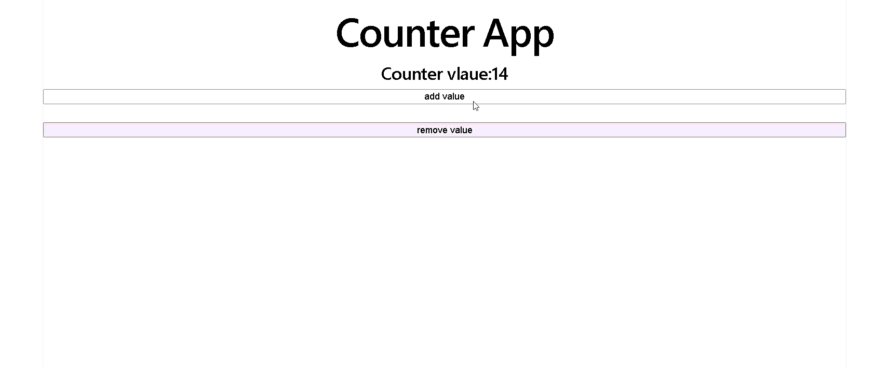

# Counter App

A simple Counter App built using **React** that demonstrates state management with hooks. Users can increment, decrement, and reset the counter through an intuitive interface.

## 🚀 Features

- ➕ Increment the counter
- ➖ Decrement the counter
- 🔄 Reset the counter
- ⚡ Instant UI updates using React state
- 📱 Responsive and clean interface

## 🛠️ Technologies Used

- React
- JavaScript (ES6+)
- CSS / Tailwind CSS _(update according to your project)_

## 📸 Demo

## 📸 Demo



## ⚙️ Installation

Clone the repository:

```bash
git clone <repository-url>
```

Navigate to the project folder:

```bash
cd counter-app
```

Install dependencies:

```bash
npm install
```

Start the development server:

```bash
npm run dev
```

## 🎯 Learning Outcomes

This project demonstrates:

- React Components
- JSX
- `useState` Hook
- Event Handling
- State Updates
- Conditional Rendering (if used)
- Component Re-rendering

## 📌 Future Improvements

- Counter history
- Custom increment/decrement value
- Dark mode
- Local Storage support
- Keyboard shortcuts

## 👨‍💻 Author

**Your Name**

GitHub: https://github.com/your-username
